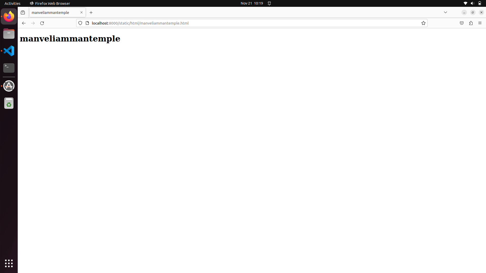
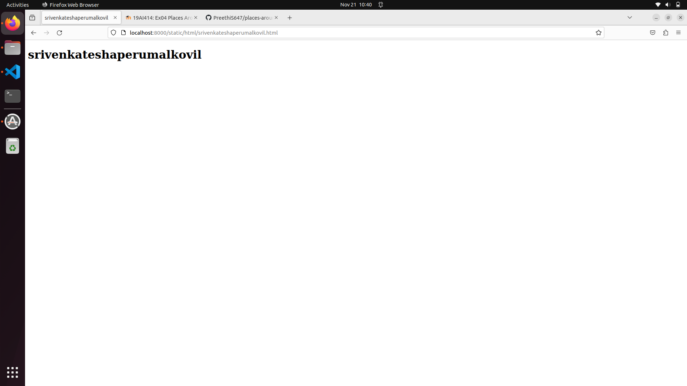
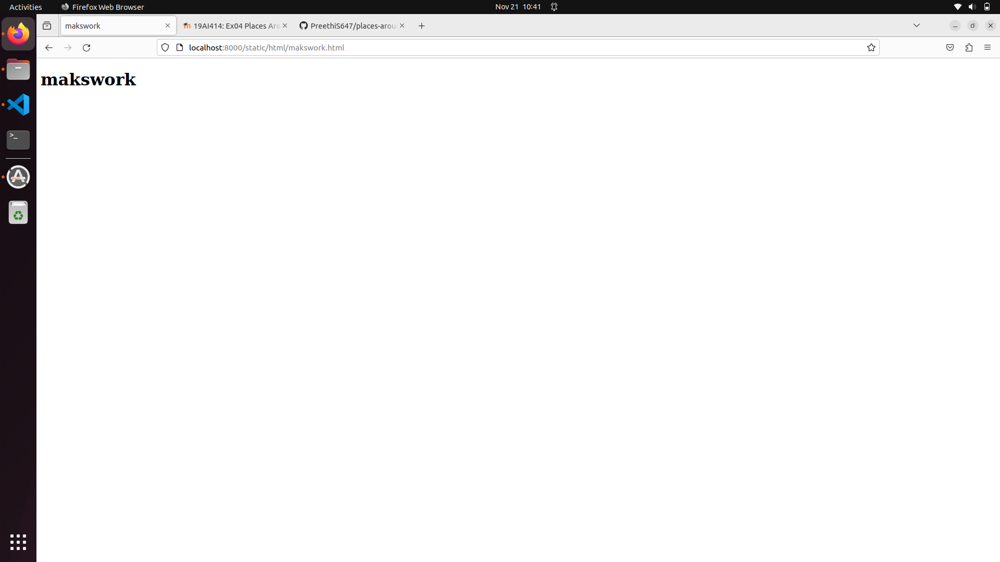

# Places Around Me
## AIM:
To develop a website to display details about the places around my house.

## Design Steps:

### Step 1:
go to image.html
### Step 2:
take screenshot

## Code:
<!DOCTYPE html>
<html>
    <head>
        <title>
            Imagemaps Demo
        </title>
    </head>
<body>
    <h1>
        Imagemaps Demo
        
<map name="image_map">
  <area alt="sabarinagar" title="sabarinagar" href="sabarinagar.html" coords="426,114,487,180" shape="rect">
  <area alt="srivenkateshaperumalkovil" title="srivenkateshaperumalkovil" href="srivenkateshaperumalkovil.html" coords="572,234,628,304" shape="rect">
  <area alt="skdhealthalliedservices" title="skdhealthalliedservices" href="skdhealthalliedservices.html" coords="368,486,433,541" shape="rect">
  <area alt="manveliammantemple" title="manveliammantemple" href="manveliammantemple.html" coords="143,341,199,412" shape="rect">
  <area alt="makswork" title="makswork" href="makswork.html" coords="355,268,475,360" shape="rect">
</map>

    </h1>
</body>
</html>

## Output:

## Result:
Thus the program executed succesfully